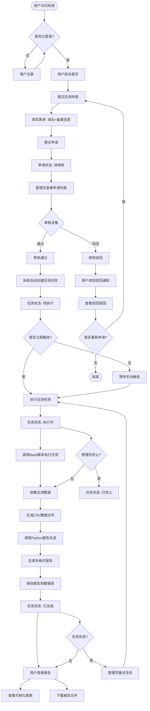
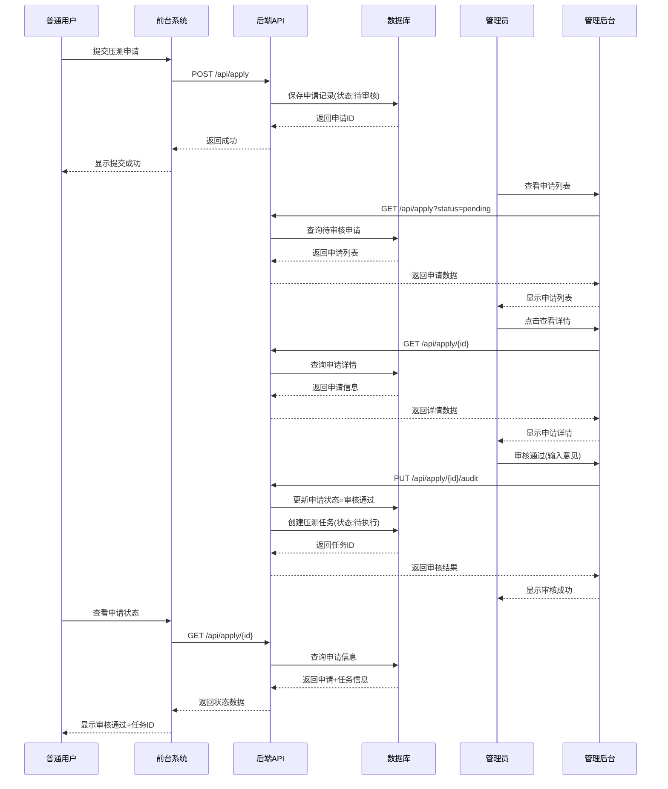
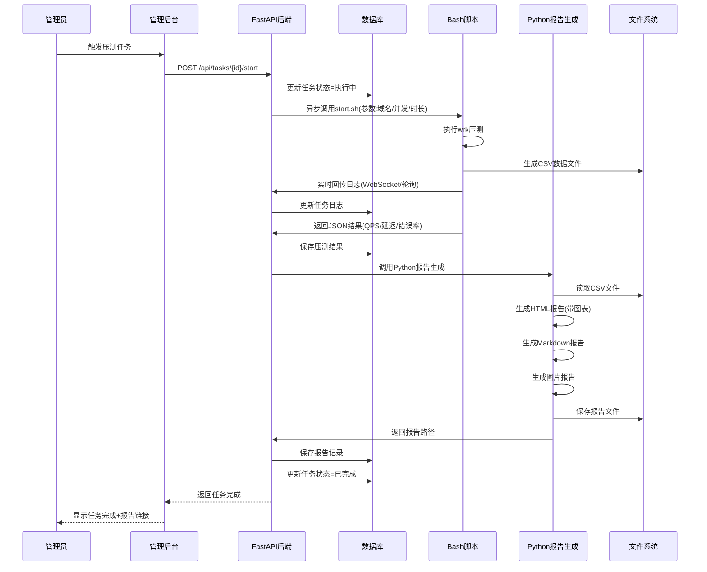
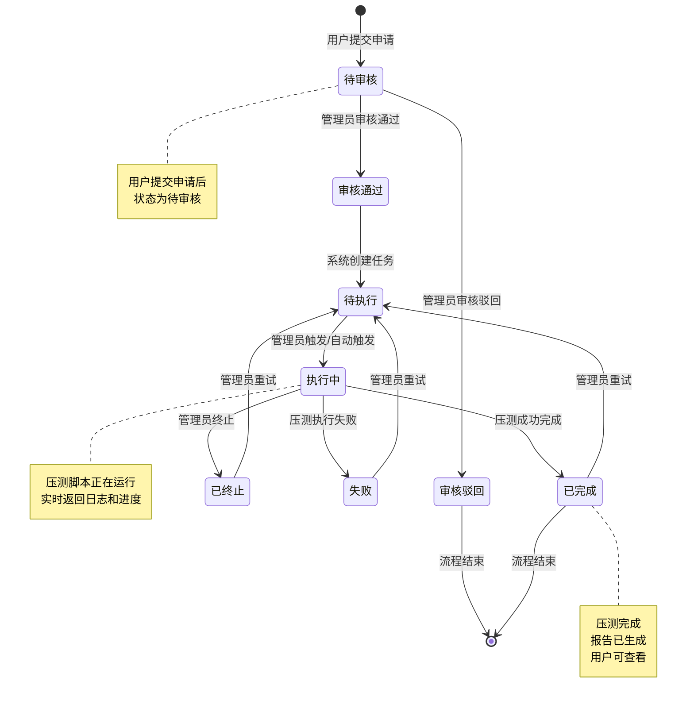

# 压测平台功能清单与业务流程图

## 一、功能清单

### 1. 用户前台（Next.js + Ant Design）

#### 1.1 用户认证模块
- **用户注册**
  - 功能：新用户注册账号
  - 字段：用户名、邮箱、密码、确认密码
  - 校验：邮箱格式、密码强度、用户名唯一性
  - 权限：所有访客

- **用户登录**
  - 功能：用户登录系统
  - 字段：用户名/邮箱、密码
  - 功能：记住登录状态、JWT Token管理
  - 权限：所有访客

- **用户登出**
  - 功能：退出登录，清除Token
  - 权限：已登录用户

#### 1.2 压测申请模块
- **提交压测申请**
  - 功能：用户提交压测申请
  - 必填字段：
    - 域名（domain）：待压测的网站域名，格式校验
    - 备案信息（record_info）：网站备案号或备案信息
  - 可选字段：
    - 申请说明：用户可填写压测目的、特殊要求等
  - 校验规则：
    - 域名格式验证（正则表达式）
    - 备案信息不能为空
    - 同一用户对同一域名不能重复提交未审核的申请
  - 权限：已登录普通用户
  - 状态：提交后状态为"待审核"

- **查看申请记录**
  - 功能：查看当前用户提交的所有压测申请
  - 显示信息：
    - 申请ID、域名、备案信息、提交时间
    - 审核状态（待审核/审核通过/审核驳回）
    - 审核意见（如有）
    - 关联的压测任务ID（审核通过后）
    - 关联的报告（压测完成后）
  - 筛选功能：
    - 按审核状态筛选（待审核/审核通过/审核驳回）
    - 按提交时间排序（最新优先）
  - 权限：已登录普通用户（仅能查看自己的申请）

- **查看审核意见**
  - 功能：查看管理员对申请的审核意见
  - 显示内容：
    - 审核结果（通过/驳回）
    - 审核意见（文字说明）
    - 审核人
    - 审核时间
  - 权限：已登录普通用户（仅能查看自己申请的审核意见）

#### 1.3 报告查看模块
- **查看压测报告**
  - 功能：查看已完成的压测报告
  - 显示内容：
    - 报告基本信息（报告ID、生成时间、关联任务）
    - 可视化图表：
      - QPS趋势图
      - 响应时间分布图
      - 错误率统计图
    - 报告文件下载（HTML/Markdown/图片格式）
  - 权限：已登录普通用户（仅能查看自己申请且审核通过、已完成压测的报告）
  - 前置条件：申请状态为"审核通过"且压测任务状态为"已完成"

#### 1.4 联系我们模块
- **提交反馈**
  - 功能：用户提交反馈或联系信息
  - 字段：姓名、邮箱、主题、内容
  - 权限：所有用户（包括未登录用户）

### 2. 管理后台（React + Ant Design Pro）

#### 2.1 用户管理模块
- **用户列表**
  - 功能：查看所有系统用户
  - 显示信息：用户ID、用户名、邮箱、角色、状态、注册时间
  - 筛选功能：
    - 按角色筛选（普通用户/管理员）
    - 按状态筛选（启用/禁用）
    - 按用户名/邮箱搜索
  - 分页：支持分页显示，每页20条
  - 权限：仅管理员

- **新增用户**
  - 功能：管理员创建新用户
  - 字段：用户名、邮箱、密码、角色（普通用户/管理员）
  - 校验：用户名唯一性、邮箱格式、密码强度
  - 权限：仅管理员

- **编辑用户**
  - 功能：修改用户信息
  - 可修改字段：邮箱、角色、状态（启用/禁用）
  - 不可修改：用户名、密码（需单独修改密码功能）
  - 权限：仅管理员

- **禁用/启用用户**
  - 功能：禁用或启用用户账号
  - 禁用后用户无法登录系统
  - 权限：仅管理员

- **角色分配**
  - 功能：为用户分配角色（普通用户/管理员）
  - 权限：仅管理员

#### 2.2 压测申请审核模块（核心功能）
- **申请列表**
  - 功能：查看所有用户提交的压测申请
  - 显示信息：
    - 申请ID、申请人、域名、备案信息
    - 提交时间、审核状态
    - 审核人、审核时间（已审核）
  - 筛选功能：
    - 按审核状态筛选（待审核/审核通过/审核驳回）
    - 按提交时间筛选（日期范围）
    - 按申请人搜索
    - 按域名搜索
  - 排序：默认按提交时间倒序
  - 分页：支持分页显示
  - 权限：仅管理员

- **查看申请详情**
  - 功能：查看申请的完整信息
  - 显示内容：
    - 申请基本信息（域名、备案信息、申请说明）
    - 申请人信息（用户名、邮箱）
    - 提交时间
    - 审核历史（审核人、审核时间、审核意见）
  - 权限：仅管理员

- **审核申请（通过）**
  - 功能：审核通过压测申请
  - 操作流程：
    1. 管理员查看申请详情
    2. 输入审核意见（可选）
    3. 点击"审核通过"
    4. 系统自动更新申请状态为"审核通过"
    5. 系统自动创建压测任务（状态为"待执行"）
    6. 可选：立即触发压测任务执行
  - 字段：审核意见（文字说明，可选）
  - 权限：仅管理员
  - 状态流转：待审核 → 审核通过

- **审核申请（驳回）**
  - 功能：驳回压测申请
  - 操作流程：
    1. 管理员查看申请详情
    2. 输入驳回原因（必填）
    3. 点击"审核驳回"
    4. 系统更新申请状态为"审核驳回"
    5. 用户可在前台查看驳回原因
  - 字段：驳回原因（文字说明，必填）
  - 权限：仅管理员
  - 状态流转：待审核 → 审核驳回

- **一键触发压测**
  - 功能：审核通过后立即触发压测任务
  - 前置条件：申请状态为"审核通过"
  - 操作：点击"立即压测"按钮
  - 系统行为：
    1. 创建压测任务（使用审核通过的域名）
    2. 使用默认压测参数（或管理员可配置）
    3. 异步执行压测任务
  - 权限：仅管理员

#### 2.3 任务管理模块
- **任务列表**
  - 功能：查看所有压测任务
  - 显示信息：
    - 任务ID、关联申请ID、目标域名
    - 压测参数（并发数、持续时间）
    - 任务状态（待执行/执行中/已完成/失败/已终止）
    - 创建时间、开始时间、结束时间
    - 执行结果（QPS、平均响应时间、错误率等）
  - 筛选功能：
    - 按任务状态筛选
    - 按创建时间筛选
    - 按域名搜索
  - 排序：默认按创建时间倒序
  - 分页：支持分页显示
  - 权限：仅管理员

- **查看任务详情**
  - 功能：查看任务的完整信息
  - 显示内容：
    - 任务基本信息（域名、参数、状态）
    - 关联申请信息
    - 执行日志（实时日志流）
    - 压测结果（JSON格式原始数据）
    - 生成的报告链接
  - 权限：仅管理员

- **终止任务**
  - 功能：终止正在执行的压测任务
  - 前置条件：任务状态为"执行中"
  - 操作：点击"终止任务"按钮
  - 系统行为：
    1. 发送终止信号给压测脚本
    2. 更新任务状态为"已终止"
    3. 保存已收集的压测数据
  - 权限：仅管理员

- **重试任务**
  - 功能：重新执行失败的任务
  - 前置条件：任务状态为"失败"或"已终止"
  - 操作：点击"重试任务"按钮
  - 系统行为：
    1. 创建新的任务记录（复用原任务参数）
    2. 异步执行压测任务
  - 权限：仅管理员

- **查看压测日志**
  - 功能：实时查看压测任务的执行日志
  - 显示方式：日志流式输出（支持自动刷新）
  - 日志内容：
    - 脚本执行过程
    - 压测进度
    - 错误信息
    - 中间结果
  - 权限：仅管理员

#### 2.4 报告管理模块
- **报告列表**
  - 功能：查看所有生成的压测报告
  - 显示信息：
    - 报告ID、关联任务ID、关联申请ID
    - 报告类型（HTML/Markdown/图片）
    - 生成时间、文件大小
    - 报告状态（生成中/已完成/失败）
  - 筛选功能：
    - 按报告类型筛选
    - 按生成时间筛选
    - 按关联任务搜索
  - 排序：默认按生成时间倒序
  - 分页：支持分页显示
  - 权限：仅管理员

- **在线预览报告**
  - 功能：在浏览器中预览报告内容
  - 支持格式：
    - HTML报告：直接渲染
    - Markdown报告：转换为HTML渲染
    - 图片报告：直接显示图片
  - 权限：仅管理员

- **下载报告**
  - 功能：下载报告文件
  - 支持格式：HTML、Markdown、图片（PNG）
  - 下载方式：直接下载文件
  - 权限：仅管理员

- **删除报告**
  - 功能：删除无效或过期的报告
  - 操作：点击"删除"按钮，确认后删除
  - 系统行为：
    1. 删除数据库记录
    2. 删除文件系统中的报告文件
  - 权限：仅管理员

### 3. 后端接口（FastAPI）

#### 3.1 用户认证接口
- `POST /api/auth/register` - 用户注册
- `POST /api/auth/login` - 用户登录
- `POST /api/auth/refresh` - 刷新Token
- `POST /api/auth/logout` - 用户登出

#### 3.2 压测申请接口
- `POST /api/apply` - 提交压测申请（普通用户）
- `GET /api/apply` - 查询申请列表（普通用户：仅自己的；管理员：全部）
- `GET /api/apply/{apply_id}` - 查看申请详情
- `PUT /api/apply/{apply_id}/audit` - 审核申请（管理员）

#### 3.3 压测任务接口
- `POST /api/tasks` - 创建压测任务（管理员）
- `GET /api/tasks` - 查询任务列表（管理员）
- `GET /api/tasks/{task_id}` - 查看任务详情
- `PUT /api/tasks/{task_id}/cancel` - 终止任务（管理员）
- `POST /api/tasks/{task_id}/retry` - 重试任务（管理员）
- `GET /api/tasks/{task_id}/logs` - 获取任务日志（流式输出）

#### 3.4 报告接口
- `GET /api/reports` - 查询报告列表
- `GET /api/reports/{report_id}` - 查看报告详情
- `GET /api/reports/{report_id}/download` - 下载报告文件
- `DELETE /api/reports/{report_id}` - 删除报告（管理员）

#### 3.5 用户管理接口（管理员）
- `GET /api/users` - 查询用户列表
- `POST /api/users` - 创建用户
- `PUT /api/users/{user_id}` - 更新用户
- `PUT /api/users/{user_id}/status` - 启用/禁用用户

## 二、业务流程图

### 2.1 完整业务流程（Mermaid格式）

### 2.2 审核流程详细图

### 2.3 压测执行流程详细图

### 2.4 状态流转图

## 三、核心业务规则

### 3.1 申请规则
1. 同一用户对同一域名，在存在"待审核"状态的申请时，不能重复提交
2. 申请提交后，状态自动设置为"待审核"
3. 审核通过后，系统自动创建压测任务，任务状态为"待执行"
4. 审核驳回后，用户可查看驳回原因，并可重新提交申请

### 3.2 审核规则
1. 只有管理员可以审核申请
2. 审核通过时，审核意见为可选
3. 审核驳回时，驳回原因为必填
4. 审核通过后，系统自动创建压测任务

### 3.3 任务规则
1. 压测任务只能由管理员创建或触发
2. 任务执行采用异步方式，避免接口阻塞
3. 任务执行过程中，支持实时查看日志
4. 任务可以终止（仅执行中状态）
5. 失败或已终止的任务可以重试

### 3.4 报告规则
1. 报告在压测任务完成后自动生成
2. 报告支持多种格式：HTML、Markdown、图片
3. 用户只能查看自己申请且审核通过、已完成压测的报告
4. 管理员可以查看所有报告

### 3.5 权限规则
1. 普通用户：
   - 可以提交压测申请
   - 可以查看自己的申请记录
   - 可以查看自己申请且审核通过、已完成压测的报告
   - 不能直接触发压测任务
   
2. 管理员：
   - 拥有普通用户的所有权限
   - 可以审核压测申请
   - 可以创建和触发压测任务
   - 可以查看所有任务和报告
   - 可以管理用户账号

